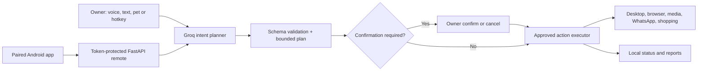
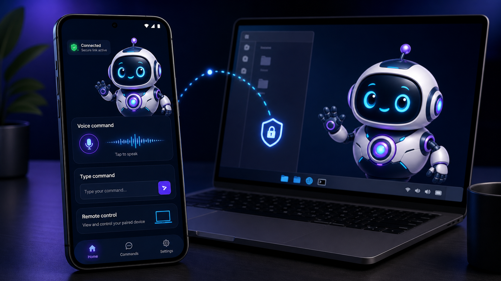

# Aksh 2.0 - Agentic AI Virtual Assistant


Aksh is a Windows-first agentic AI companion that turns natural Hindi,
Hinglish, or English requests into bounded action plans. It lives as a draggable
desktop pet, can work through approved desktop tools, and accepts commands from
the laptop or a separately paired Android phone.

> The images in this README are product concept visuals. The desktop pet and
> Android app are real; exact operating-system screens vary by device.

## What makes Aksh agentic?

Aksh does more than match keywords. Groq converts a request into a short,
structured plan using only actions in the allow-listed catalog. The executor
runs those steps in order, stops after failures, and pauses protected steps for
owner confirmation. A corrected command replaces the pending action instead of
accidentally approving an older interpretation.

| Capability | What Aksh can do |
| --- | --- |
| Natural conversation | Understand Hindi, Hinglish, English, follow-ups, corrections, and fuzzy names |
| Desktop agent | Open apps/sites, search, control windows/media, and run bounded multi-step plans |
| Communications | Use WhatsApp Desktop or WhatsApp Web for confirmed messages and calls |
| Media | Resolve a real YouTube result, honor an explicitly requested browser, and control playback |
| Shopping | Maintain a Flipkart session across search, next/previous, refinements, size, and add-to-cart |
| Meeting Mode | Silently transcribe, suggest live written answers, review replies, and create reports |
| Android companion | Send voice/text commands and view/control the laptop after explicit permission |
| Desktop pet | Drag, resize, double-click to listen, use expressions, or activate with `Ctrl+Alt+K` |

## Safety and privacy defaults

- The Groq key entered in first-run setup is encrypted with Windows DPAPI.
- The phone pairing token is random, DPAPI-protected on Windows, and encrypted
  with Android Keystore on the phone.
- The remote API binds to `127.0.0.1`; Cloudflared is the only public ingress.
- Remote-screen access is off by default and has a separate short-lived session.
- Shutdown, restart, lock, and sleep always require a separate owner
  confirmation. Messages, calls, add-to-cart, and other sensitive actions use
  the configured confirmation policy.
- The public repository has no shared Cloudflare Worker, KV namespace, API key,
  pairing token, phone number, meeting transcript, browser profile, or CV.
- Checkout and payment are intentionally not automated.

See [SECURITY.md](SECURITY.md) and [docs/PRIVACY.md](docs/PRIVACY.md) before
enabling remote control or Meeting Mode.

## Architecture



The code is organized by responsibility:

```text
aksh.py                         desktop entry point
backend/
  agent/                        action catalog and bounded executor
  actions/                      approved desktop and web tools
  audio/                        listening, voiceprint, speech, and TTS
  brain/                        Groq planner, schema, memory, local fallback
  meeting/                      dual-source capture, coaching, reports
  profile/                      local CV/profile context
  remote/                       pairing, jobs, discovery, tunnel, API
  remote_desktop/               screen sessions, capture, WebRTC, input
  shopping/                     stateful Flipkart workflow
frontend/
  desktop/                      pet, panel, hotkey, meeting UI
  mobile/android/               native Android remote app
infrastructure/
  cloudflare/discovery-worker/  per-user discovery relay template
  windows/                      setup, tunnel, and optional autostart
docs/                           public security/privacy visuals and guides
tests/                          behavior, regression, and safety tests
```

## Requirements

- Windows 10 or Windows 11
- Python 3.10
- Internet connection and your own Groq API key
- Android 8.0+ for the optional phone companion
- Node.js 22+ and a Cloudflare account only when deploying phone discovery
- JDK 17 and Android SDK only when building the Android app

The laptop microphone is optional when commands are sent as text or phone audio.

## Windows setup

```powershell
git clone https://github.com/Aashiskr/Aksh-Virtual-Assistant-2.0.git
cd Aksh-Virtual-Assistant-2.0
.\setup_aksh.bat
.\run_aksh.bat
```

Setup creates a project-local `.venv`, installs dependencies, downloads a
digitally signed Cloudflared binary, and creates the ignored `.env` file. On the
first launch Aksh privately asks for a Groq key and stores it in
`data/groq_key.dat`, encrypted for the current Windows account.

Autostart is optional and is not silently enabled:

```powershell
powershell -ExecutionPolicy Bypass -File infrastructure\windows\enable_autostart.ps1
```

Disable it with `infrastructure\windows\disable_autostart.ps1`.

## Use your own Cloudflare relay

Aksh deliberately ships without the developer's Worker URL or KV ID. Deploy a
small relay in your own Cloudflare account by following
[the relay guide](infrastructure/cloudflare/discovery-worker/README.md). Then
put the resulting HTTPS Worker URL in the laptop's ignored `.env`:

```dotenv
AKSH_DISCOVERY_URL=https://your-worker.your-subdomain.workers.dev
```

Enter the same URL in the Android app. The Worker stores only the current HTTPS
tunnel URL and update time. The pairing token authenticates reads/writes but is
never stored in Cloudflare KV.

Without a relay, the Android app can still use a current Quick Tunnel URL in its
manual HTTPS fallback field, but that URL can change after Aksh restarts.

## Android companion



Build the app:

```powershell
cd frontend\mobile\android
.\gradlew.bat testDebugUnitTest lintDebug assembleDebug
```

The APK is generated at
`app/build/outputs/apk/debug/app-debug.apk`. Install it on a trusted phone, then
open **Aksh pet > Phone remote setup** and copy:

1. Your Cloudflare discovery relay URL
2. Device ID
3. Pairing token

The app remembers the configuration. The token is encrypted with Android
Keystore, so restarting the phone or laptop normally does not require pairing
again.

### Remote-screen gestures

- Tap: click
- Double-tap: double-click
- Hold: right-click
- One-finger vertical swipe: scroll
- One-finger horizontal/diagonal motion: move or drag the pointer
- Two fingers at 100%: scroll
- Pinch: zoom from 100% to 250%
- Two fingers above 100%: pan across hidden areas
- Fullscreen: immersive landscape mode

The server accepts only bounded pointer coordinates, bounded scroll values,
safe text paste, and allow-listed quick keys.

## Activation and example commands

Activate with **Hey Aksh**, pet double-click, `Ctrl+Alt+K`, the desktop command
panel, or the paired phone.

```text
Brave mein dezignbank.com kholo
Brave open karke YouTube par achhe Hindi songs chalao
Sudheer Sir ko WhatsApp call karo
Mere liye blue oversized shirt dhoondho
Isko cart mein daalo
Mic off kar lo
Computer sleep karo
Confirm
```

For a protected action, say the command first and then say only `confirm` or
`cancel`. An action-bearing sentence containing the word "confirmed" does not
approve an older pending action.

## Meeting Mode

Start it from the pet's context menu. Participant audio and owner microphone
audio are captured separately; participant questions can produce silent written
suggestions, while the owner's reply is recorded for review instead of entering
the normal command executor. Stopping the meeting creates Markdown and JSON
reports under the ignored `data/meetings/` directory.

Aksh requests Windows capture exclusion for its pet and overlays, but this is a
best-effort accidental-sharing control, not a guarantee against every capture
implementation. Meeting audio/text is sent to Groq for transcription and
analysis. Use it only with participant consent and where AI assistance is
allowed.

## Local data map

| Local path | Contents | Committed? |
| --- | --- | --- |
| `.env` | optional environment overrides | No |
| `data/groq_key.dat` | DPAPI-encrypted Groq key | No |
| `data/remote_token.dat` | DPAPI-encrypted pairing token | No |
| `data/settings.json` | local preferences and pet position | No |
| `data/user_profile.json` | imported CV/profile text | No |
| `data/meetings/` | private transcripts and reports | No |
| `logs/` | local diagnostic logs | No |
| `private/` | owner-only documents such as the secret inventory PDF | No |

## Development and validation

```powershell
py -3.10 -m unittest discover -s tests -v
node --test frontend\mobile\android\gesture_tests.mjs
cd infrastructure\cloudflare\discovery-worker
npm ci
npm test
```

Before committing, run the tracked-file guard:

```powershell
py -3.10 scripts\check_public_repo.py
```

The guard rejects common API-key formats, private keys, local Windows paths,
and forbidden runtime/secret files if they are tracked by Git.

## Limitations

- Windows is the supported desktop platform.
- WhatsApp automation depends on the installed app/web UI and may need updates
  when WhatsApp changes accessibility labels.
- Remote screen currently shares the primary monitor only. Windows sign-in,
  secure UAC prompts, DRM-protected content, and sleeping/offline laptops cannot
  be controlled.
- Quick Tunnels and free third-party APIs can have availability or quota limits.
- Aksh is a personal automation project, not an unattended enterprise remote
  administration product.

## Contributing

Read [CONTRIBUTING.md](CONTRIBUTING.md). Never include real API keys, pairing
tokens, phone numbers, CVs, browser profiles, transcripts, private screenshots,
or account-specific Wrangler configuration in an issue or pull request.
